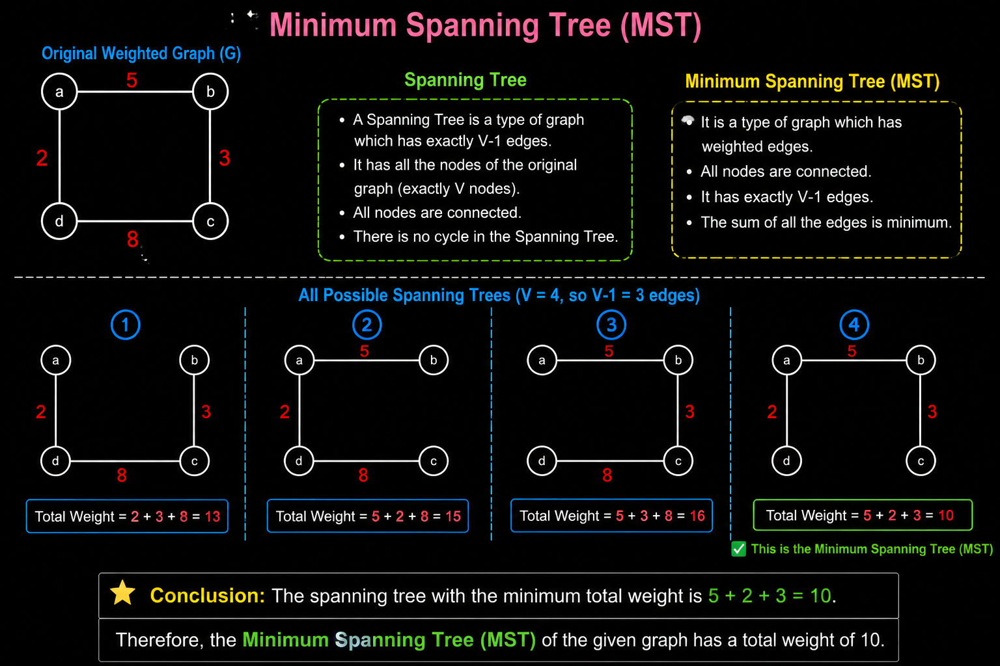

# What is Minimum Spanning Tree (MST)?

Before understanding a **Minimum Spanning Tree (MST)**, let's first understand what a **Spanning Tree** is.

## What is a Spanning Tree?

A **Spanning Tree** of a graph is a subgraph that:

- Has exactly **V - 1 edges**, where **V** is the number of vertices.
- Contains **all the vertices** of the original graph.
- Is **fully connected**, meaning every node is reachable from every other node.
- **Does not contain any cycle**, because it is a **tree**.

---

## What is a Minimum Spanning Tree (MST)?

A **Minimum Spanning Tree** is a spanning tree of a **weighted, connected graph** such that:

- It contains **all the vertices**.
- All the vertices are **connected**.
- It has **exactly V - 1 edges**.
- It contains **no cycles**.
- The **sum of the weights of ALL selected edges is MINIMUM** among all possible spanning trees.

---

## Example

The image below demonstrates a weighted connected graph and several possible spanning trees.

- The original graph has **4 vertices** and **4 weighted edges**.
- A spanning tree must select **3 edges** (since `V = 4`).
- Different combinations of 3 edges produce different spanning trees.
- The **Minimum Spanning Tree** is the one whose **total edge weight is the smallest** while keeping all vertices connected.

### In this example

Original edge weights:

- **a → b = 5**
- **a → d = 2**
- **b → c = 3**
- **d → c = 8**

Possible spanning trees include:

1. `{2, 3, 8}` → Total = **13**
2. `{2, 5, 8}` → Total = **15**
3. `{2, 5, 3}` → Total = **10** ✅ **Minimum Spanning Tree**
4. `{5, 3, 8}` → Total = **16**

Hence, the **Minimum Spanning Tree (MST)** is formed by choosing the edges with weights **2, 5, and 3**, giving the **minimum total weight of 10**.

---

## Key Points

- A graph can have **multiple spanning trees**.
- The **Minimum Spanning Tree** is the spanning tree with the **least total edge weight**.
- MST algorithms work only on **connected, weighted graphs**.
- Popular algorithms:
  - **Prim's Algorithm**
  - **Kruskal's Algorithm**

